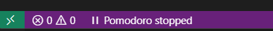
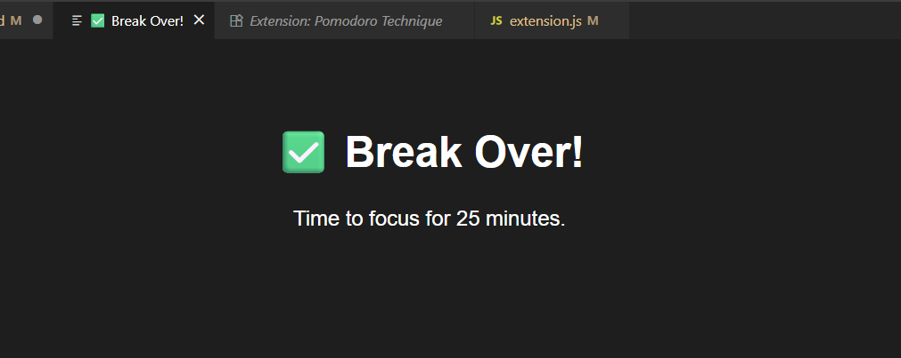
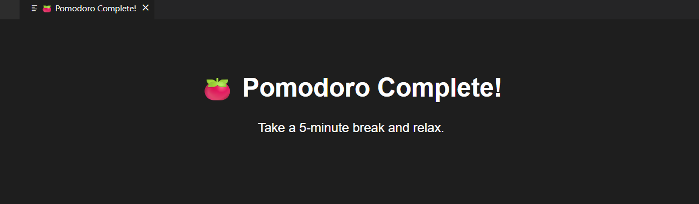
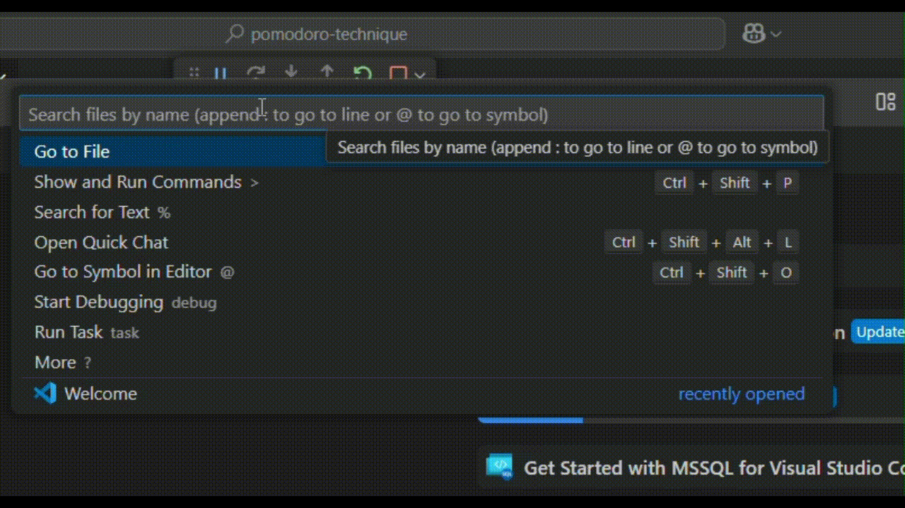

# Pomodoro Timer for VS Code

A simple, auto-cycling Pomodoro timer integrated into VS Code.

## Features
- 25-minute focus sessions followed by 5-minute breaks
- Auto start next Pomodoro cycle after break
- Timer displayed in Status Bar
- Webview-based notification in new tab (Auto close after 5 seconds)
- Sound alerts (Will blocked by Autoplay Policy)

## Outputs
##### Timer displayed in Status Bar
**Start Pomodoro**
  

**Stop Pomodoro**
  

##### Webview-based Notification
Pomodoro Cycle Start  
  
Break  
|

## Usage
1. Press `Ctrl+Shift+P` (or `Cmd+Shift+P` on Mac)
2. Search for [Command]. For example, `Pomodoro:Start`
3. Work until the timer alerts you
4. Take a break and get ready for the next cycle

## Commands
| Command  | Description |
| -------------| ------------- |
| **pomodoro.start**  | Starts a Pomodoro cycle  |
| **pomodoro.stop**  | Stops timer |
| **pomodoro.reset**  | Reset timer |

## Release Notes
##### Version 0.0.9
- Initial release with auto-cycling Pomodoro
- Sound notification and Webview-based notification
